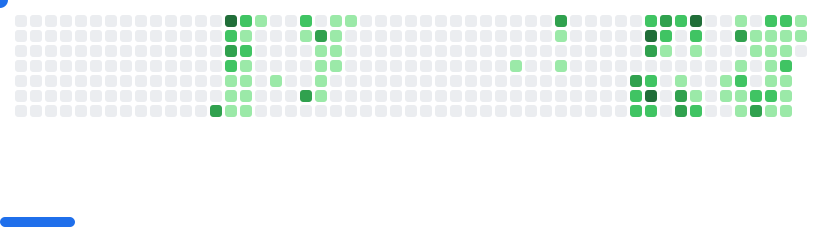

Hi  My name is Phúc
=============================================================================================================================

Web Developer
-------------

I have around 4 years of experience in programming, with a strong passion for building practical and efficient applications.

Currently, I am focusing on improving my skills in modern technologies such as C# and React, while also exploring how real-world development workflows evolve in the age of AI.

I’m especially interested in writing clean, maintainable code and understanding how professional developers collaborate, ship products, and adapt to new tools and paradigms.

* 🌍  I'm based in Can Tho
* ✉️  You can contact me at [trantrongphuc1501@gmail.com](mailto:trantrongphuc1501@gmail.com)
* 🚀  I'm currently working on [CTU-Scheduler](http://github.com/d3nhatv0lam/CTU-Scheduler)
* 🧠  I'm currently learning C#-React Stack

#Skills

<table>
<tr>
<td></td>

<td></td>

<td></td>

<td></td>

<td></td>

<td></td>

<td></td>

<td></td>

<td></td>

<td></td>

<td></td>

<td></td>

<td></td>

<td></td>

<td></td>

<td></td>

<td></td>

</tr>
</table>
### Socials

<table>
<tr>

<td>
<a href="https://www.github.com/phuctran1501" target="_blank" style="text-decoration: none;">
<picture>
<source media="(prefers-color-scheme: dark)" srcset="https://raw.githubusercontent.com/danielcranney/readme-generator/main/public/icons/socials/github-dark.svg" />
<source media="(prefers-color-scheme: light)" srcset="https://raw.githubusercontent.com/danielcranney/readme-generator/main/public/icons/socials/github.svg" />

</picture>
</a>
</td>

<td>
<a href="https://www.linkedin.com/in/ph%c3%bac-tr%e1%ba%a7n-a3a02b2bb" target="_blank" style="text-decoration: none;">
<picture>
<source media="(prefers-color-scheme: dark)" srcset="https://raw.githubusercontent.com/danielcranney/readme-generator/main/public/icons/socials/linkedin-dark.svg" />
<source media="(prefers-color-scheme: light)" srcset="https://raw.githubusercontent.com/danielcranney/readme-generator/main/public/icons/socials/linkedin.svg" />

</picture>
</a>
</td>

<td>
<a href="https://www.youtube.com/@trantrongphucb2303" target="_blank" style="text-decoration: none;">
<picture>
<source media="(prefers-color-scheme: dark)" srcset="https://raw.githubusercontent.com/danielcranney/readme-generator/main/public/icons/socials/youtube-dark.svg" />
<source media="(prefers-color-scheme: light)" srcset="https://raw.githubusercontent.com/danielcranney/readme-generator/main/public/icons/socials/youtube.svg" />

</picture>
</a>
</td>

<td>
<a href="https://www.facebook.com/phuctran1501" target="_blank" style="text-decoration: none;">
<picture>
<source media="(prefers-color-scheme: dark)" srcset="https://raw.githubusercontent.com/danielcranney/readme-generator/main/public/icons/socials/facebook-dark.svg" />
<source media="(prefers-color-scheme: light)" srcset="https://raw.githubusercontent.com/danielcranney/readme-generator/main/public/icons/socials/facebook.svg" />

</picture>
</a>
</td>

</tr>
</table>

### Badges

<b>My GitHub Stats</b>

<!-- Proudly created with GPRM ( https://gprm.itsvg.in ) -->
<picture>
  <source
    media="(prefers-color-scheme: dark)"
    srcset="images/breakout-dark.svg"
  />
  <source
    media="(prefers-color-scheme: light)"
    srcset="images/breakout-light.svg"
  />
  
</picture>
