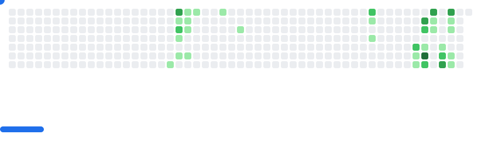

# "\t""\t""\t" 💫 About Me: Hi I'm Phúc 

🌱 I’m currently learning JS Frameworks  💬 Ask me about ANYTHING  📫 How to reach me : trantrongphuc1501@gmail.com  👨‍💻 My Dream: https://www.axonactive.com/  ⚡ Fun fact: I can write "Hello World" in C++ :DD 

## 🌐 Socials:
    

# 💻 Tech Stack:
)                    
# 📊 GitHub Stats:
 

### ✍️ Random Dev Quote

---

<!-- Proudly created with GPRM ( https://gprm.itsvg.in ) -->
<picture>
  <source
    media="(prefers-color-scheme: dark)"
    srcset="images/breakout-dark.svg"
  />
  <source
    media="(prefers-color-scheme: light)"
    srcset="images/breakout-light.svg"
  />
  
</picture>
